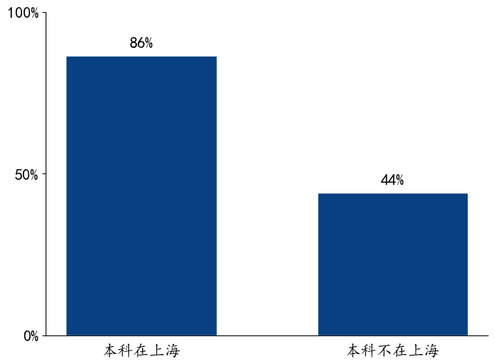
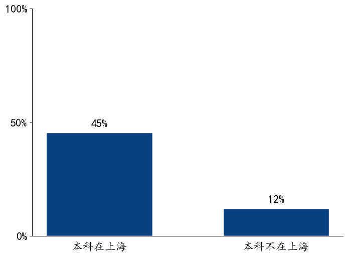
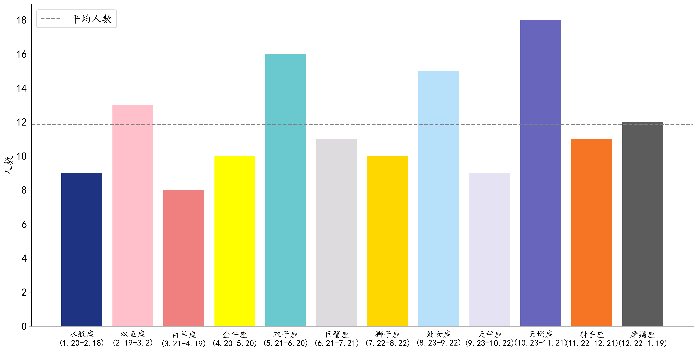
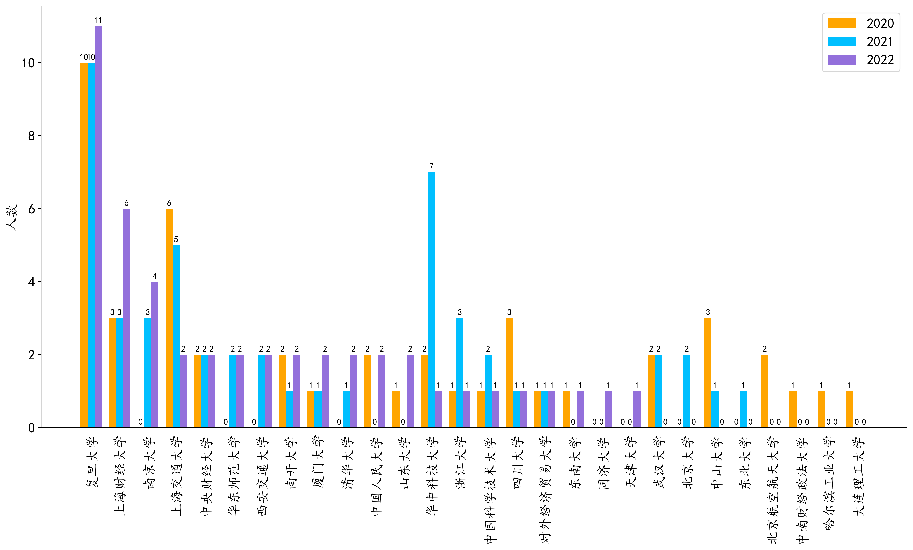
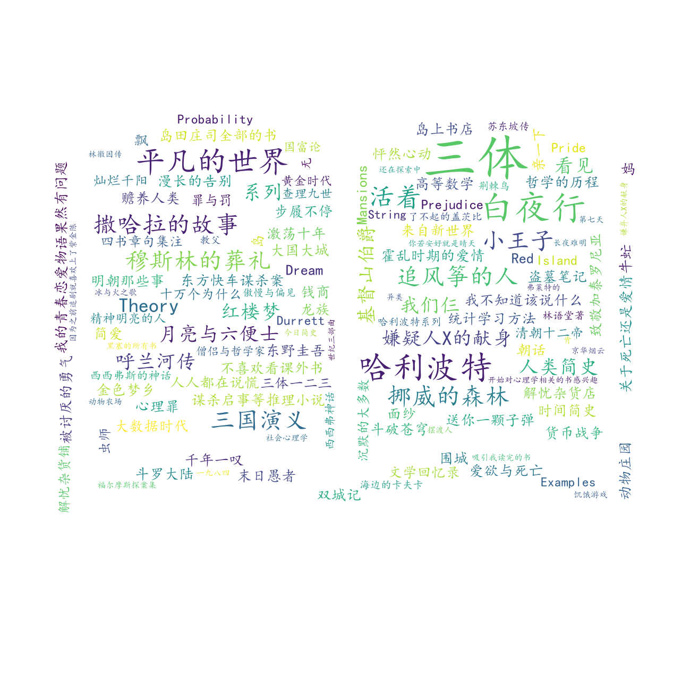
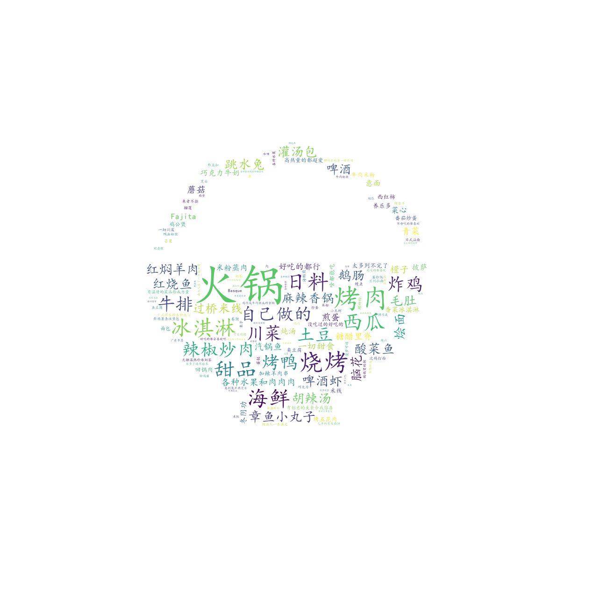
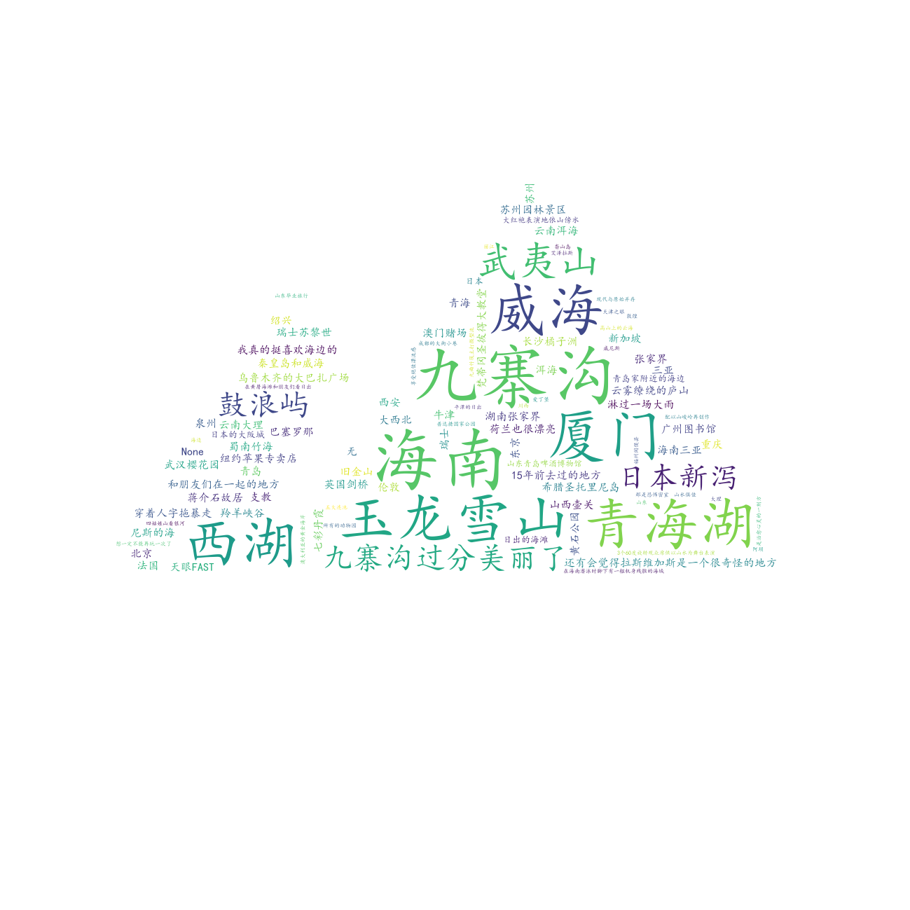
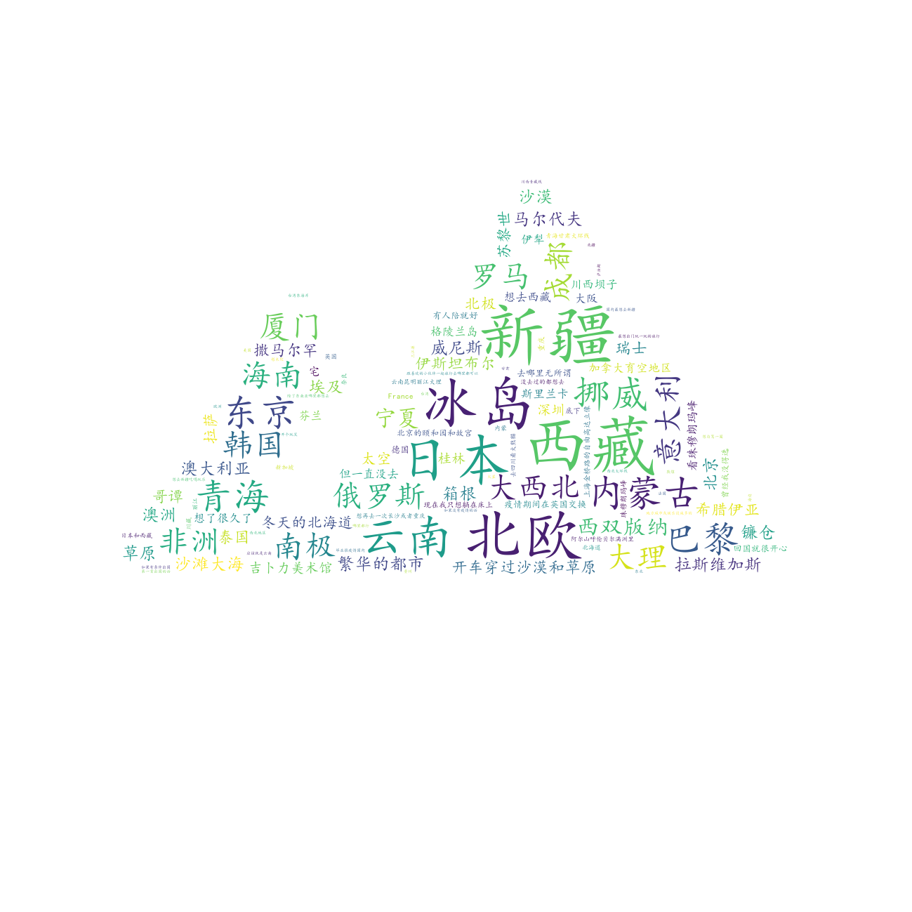

## 心得体会与遇到的困难

Who is who中的新生介绍信息大部分都是文本数据，并且有很多是非结构化的数据。在对这种文本类型居多、非结构化数据居多的数据进行可视化时，首先需要将它们尽量处理成结构化的数据。

处理过程中遇到了很多细小的但又影响分析结果的困难，例如：

- 有的同学用英文填写信息，她填的“Capricorn”对应的是其他同学填的“摩羯座”，我们只能手动将数据修正。
- 有的同学写了错别字，她填的“魔羯座”对应的是其他同学填的“摩羯座”，我们也只能手动将数据修正。
- 有的同学在填写的时候，在前面后后面多了一个空格，如“ 双鱼座”和“双鱼座”，肉眼看上去都是双鱼座，但前者多了一个空格，导致在统计词频时出错。这要求我们必须仔细检查数据，否则可能都发现不了，导致后续的数据分析存在误差。

## 方便进行结构化的数据可视化

### 本科是否在上海与是否经历过隔离/做过志愿者

#### SMART分析过程

•Specific：提出问题：本科是上海高校的同学，经历过隔离和做过志愿者的比例是否高于本科非上海高校的同学？

•Measurable：经历过隔离和做过志愿者的同学比例可通过数据表格中的“是否经历过隔离”和“是否做过志愿者”进行量化。本科是否在上海就读可以根据本科毕业院校判断。

•Attainable：数据表中包含2022级同学的本科毕业院校、“是否经历过隔离”和“是否做过志愿者”的信息。

•Relevant：疫情相关的问题，可以验证自己的直觉猜想。

•Time-Bound：需要根据人为判断文本信息，并将其结构化。预计需要花费不到1小时。

```python
# =====是否经历过隔离或做过志愿者=====
def isolation_volunteer(blocked, type):
    fig=plt.figure(figsize=(8,6),dpi=100)
    ax=plt.axes()
    for line in ['right','top']:
        ax.spines[line].set_visible(False)
    # 去除横坐标的刻度线
    ax.tick_params(bottom=False)
    # 绘制柱状图
    plt.bar([0, 0.5], blocked.loc[type], color='#084082', width=0.3, edgecolor='white')
    # 在柱子上方显示纵坐标
    plt.text(0, blocked.loc[type]['本科在上海']+0.02,'%1.0f'%(100*blocked.loc[type]['本科在上海']) + '%', ha='center',va='bottom', fontsize=16)
    plt.text(0.5, blocked.loc[type]['本科不在上海']+0.02,'%1.0f'%(100*blocked.loc[type]['本科不在上海']) + '%', ha='center',va='bottom', fontsize=16)
    # 添加横刻度
    plt.xticks([0, 0.5], ['本科在上海', '本科不在上海'], fontsize=16)
    # 添加纵刻度
    plt.yticks(np.arange(0, 1.1, 0.5), fontsize=16)
    # 显示百分比
    def to_percent(temp, position):
        return '%1.0f'%(100*temp) + '%'
    plt.gca().yaxis.set_major_formatter(FuncFormatter(to_percent))
    # 保存为本地文件
    fig.savefig('output/{}.png'.format(type),format='png', facecolor='white', bbox_inches='tight')
```





### 星座分布（基础柱状图）

#### SMART分析过程

•Specific：提出问题：各个星座的同学人数是否分布均匀？

•Measurable：星座数据本身是规范的文本，可以统计词频来获得每个星座的人数。

•Attainable：数据表中包含三个年级同学的星座信息。

•Relevant：可以验证自己的直觉猜想：大家出生的日期是否分布均匀。

•Time-Bound：需要人为检查并修改数据，例如错别字、中英文等。预计花费不到1小时。

```python
# =====星座柱状图=====
def draw_constellations(df):
    # 统计各星座的频率
    constellations = df['星座'].value_counts().reset_index()
    # 修改列名
    constellations.rename(columns={'星座': '人数'}, inplace=True)
    # 将星座名映射为带有日期的星座名，并为每一个星座按时间指定顺序。同时，为每一个星座指定颜色
    constellations_order = {
        '水瓶座': ['水瓶座(1.20-2.18)',1,'#1e3482'],
        '双鱼座': ['双鱼座(2.19-3.2)',2,'pink'],
        '白羊座': ['白羊座(3.21-4.19)',3,'red'],
        '金牛座': ['金牛座(4.20-5.20)',4,'yellow'],
        '双子座': ['双子座(5.21-6.20)',5,'#6ac8cf'],
        '巨蟹座': ['巨蟹座(6.21-7.21)',6,'#dddbde'],
        '狮子座': ['狮子座(7.22-8.22)',7,'gold'],
        '处女座': ['处女座(8.23-9.22)',8,'#b7e1fb'],
        '天秤座': ['天秤座(9.23-10.22)',9,'#e5e2f4'],
        '天蝎座': ['天蝎座(10.23-11.21)',10,'#6766bc'],
        '射手座': ['射手座(11.22-12.21)',11,'#f67524'],
        '摩羯座': ['摩羯座(12.22-1.19)',12,'#5c5c5c'],
    }
    constellations['星座'] = constellations['index'].apply(lambda constellations: constellations_order[constellations][0])
    constellations['顺序'] = constellations['index'].apply(lambda constellations: constellations_order[constellations][1])
    # 升序排列所有星座，即1月的星座在最上方
    constellations.sort_values(by=['顺序'], inplace=True)
    # 挑选出需要的列
    constellations = constellations[['星座', '人数']]
    #设置画布的尺寸
    fig=plt.figure(figsize=(10,7), dpi=300)
    ax=plt.axes()
    # 隐藏上侧和右侧的框线
    for line in ['right','top']:
        ax.spines[line].set_visible(False)
    # 去除横坐标的刻度线
    ax.tick_params(bottom=False)
    # 绘制柱状图
    plt.bar(x = constellations['星座'], height = constellations['人数'], color=[value[2] for value in list(constellations_order.values())])
    # 添加平均线
    plt.axhline(constellations['人数'].mean(), color='gray', ls='--', label='平均人数')
    #设置y轴坐标标签
    plt.ylabel('人数',fontsize=12)
    # 添加横刻度
    plt.xticks(constellations['星座'], rotation=90)
    # 添加纵刻度
    plt.yticks(np.arange(0, 19, 2))
    plt.legend(loc='upper left')
    # 保存为本地文件
    fig.savefig('output/星座.png',format='png', facecolor='white', bbox_inches='tight')
```



### 本科毕业院校（多组柱状图）

#### SMART分析过程

•Specific：提出问题：DS&BA项目从哪些本科院校、哪些本科专业招生？各年度之间是否有变化？

•Measurable：本科毕业院校数据本身是规范的文本，可以统计词频来获得每个学校的人数。本科专业的名字可能存在差异，例如“经济统计”和“经济统计学”，其实是一个专业，只是同学们填的不同，因此适合用词云图来展现关键词。

•Attainable：数据表中包含三个年级同学的本科毕业院校信息和本科专业信息。

•Relevant：可以为关注DS&BA项目的同学提供参考：哪些院校、哪些专业的同学进入过DS&BA项目。

•Time-Bound：需要人为检查并修改数据，例如错别字、院校缩写等。预计花费不到2小时。

```python
# =====本科毕业院校柱状图=====
def draw_undergraduate_university(df):
    # 提取出各年份的本科毕业院校
    undergraduate_university = df.groupby('入学年份')['本科毕业院校'].value_counts().to_frame()
    # 修改列名
    undergraduate_university.columns = ['人数']
    # 重设索引，避免处理多重索引
    undergraduate_university.reset_index(inplace=True)
    # 将长型数据转换为宽型数据
    undergraduate_university = undergraduate_university.pivot(index='本科毕业院校', columns='入学年份', values='人数')
    # 将空值填充为0
    undergraduate_university.fillna(0, inplace=True)
    # 将数据降序排列
    undergraduate_university.sort_values(by=['2022', '2021', '2020'], ascending=False, na_position='last', inplace=True)
    # 创建年份与颜色的字典
    color_year = {'2020': '#4E9ACB',
                  '2021': '#1E6DB2',
                  '2022': '#084082',}
    # 创建画布
    fig=plt.figure(figsize=(18,8), dpi=300)
    ax=plt.axes()
    # 隐藏上侧和右侧的框线
    for line in ['right','top']:
        ax.spines[line].set_visible(False)
    # 去除横坐标的刻度线
    ax.tick_params(bottom=False)
    # 设定每一个柱子的宽度
    bar_width=0.2
    # 画图
    for year in undergraduate_university.columns:
        # 指定各年的所有柱子的横坐标。乘以0.8是因为一个柱子群一共只有3个柱子，0.8就代表4个柱子，剩下一个柱子的距离用来分割每个柱子群。
        globals()['x_'+year] = np.arange(undergraduate_university.shape[0])*0.8 + (int(year)-2020)*bar_width
        # 获取各年的所有柱子的纵坐标
        globals()['data_'+year] = undergraduate_university[year]
        plt.bar(globals()['x_'+year], globals()['data_'+year], width=bar_width, color=color_year[year],
                 edgecolor='None', label=year)
        # 在柱子上方显示纵坐标
        for x,y in zip(globals()['x_'+year], globals()['data_'+year]):
            plt.text(x,y+0.05,'%.0f' %y, ha='center',va='bottom')
    # 添加横坐标
    plt.xticks(globals()['x_'+undergraduate_university.columns[int(undergraduate_university.shape[1]/2)]], undergraduate_university.index, rotation=90)
    # 添加图例
    plt.legend()
    # 保存为本地文件
    fig.savefig('output/本科毕业院校.png',format='png', facecolor='white', bbox_inches='tight')
```



### 本科专业（词云图）

```python
# =====绘制词云图=====
def draw_word_cloud(text_path, output_path, outline_image_path = imread(r'.\data\黑圆点.png')):
    # 字体路径
    font_path = r'C:\Windows\Fonts\simhei.ttf'
    # 读取文本
    text = open(text_path, encoding='UTF-8').read()
    # 配置词云图
    wc = WordCloud(font_path=font_path, background_color="white", max_words=2000, mask=outline_image_path,
                   max_font_size=100, random_state=42, width=1000, height=860, margin=2)
    # 生成词云图
    wc.generate(text)
    plt.figure(dpi=300)
    plt.imshow(wc, interpolation="bilinear")
    plt.axis("off")
    # 保存为本地文件
    wc.to_file(output_path)
```


### 各年度入学的本科专业

```python
# =====绘制各年度年本科专业词云图=====
for year in ['2020', '2021', '2022']:
    df[df['入学年份']==year]['本科专业'].to_csv(r'.\data\undergraduate_major_{}.txt'.format(year), index=False, header=False)
    draw_word_cloud(text_path=r'.\data\undergraduate_major_{}.txt'.format(year), output_path=r'.\output\{}年本科专业词云图.png'.format(year))
```

2020年：


2021年：


2022年：


## 不方便进行结构化的数据可视化

### SMART分析过程

•Specific：提出问题：DS&BA项目的同学有何兴趣爱好？去过的以及想去的地方有哪些？

•Measurable：兴趣爱好等数据都是同学们自定义的文本数据，本身并不规范，因此难以进行结构化。可以通过词云图展现关键词的出现频率。

•Attainable：数据表中包含三个年级同学的兴趣爱好等信息。2022级同学还包含去过的和想去的地方等信息。

•Relevant：可以帮助了解DS&BA项目的同学的生活，找到相同爱好的同学们、组织大家都喜欢的聚会活动等。

•Time-Bound：需要处理数据、生成词云图，预计花费不到2小时。

### 兴趣爱好

```python
# =====绘制兴趣爱好词云图=====
df['兴趣爱好'].to_csv(r'.\data\hobby.txt', index=False, header=False)
draw_word_cloud(text_path=r'.\data\hobby.txt', output_path=r'.\output\兴趣爱好词云图.png', outline_image_path = imread(r'.\data\篮球.png'))
```


### 最喜欢的书

```python
# =====绘制最喜欢的书词云图=====
df['最喜欢的书'].to_csv(r'.\data\favorite_book.txt', index=False, header=False)
draw_word_cloud(text_path=r'.\data\favorite_book.txt', output_path=r'.\output\最喜欢的书.png', outline_image_path = imread(r'.\data\书本.png'))
```



### 最喜欢的电影

```python
# =====绘制最喜欢的电影词云图=====
df['最喜欢的电影'].to_csv(r'.\data\favorite_movie.txt', index=False, header=False)
draw_word_cloud(text_path=r'.\data\favorite_movie.txt', output_path=r'.\output\最喜欢的电影.png', outline_image_path = imread(r'.\data\电影.png'))
```


### 最喜欢的食物

```python
# =====绘制最喜欢的食物词云图=====
df['最喜欢的食物'].to_csv(r'.\data\favorite_food.txt', index=False, header=False)
draw_word_cloud(text_path=r'.\data\favorite_food.txt', output_path=r'.\output\最喜欢的食物.png', outline_image_path = imread(r'.\data\食物.jpg'))
```



### 去过令你印象最深刻的地方

```python
# =====绘制去过令你印象最深刻的地方词云图=====
df['去过令你印象最深刻的地方'].to_csv(r'.\data\most_impressing_place.txt', index=False, header=False)
draw_word_cloud(text_path=r'.\data\most_impressing_place.txt', output_path=r'.\output\去过令你印象最深刻的地方.png', outline_image_path = imread(r'.\data\山脉.jpg'))
```



### 疫情结束后最想去的地方

```python
# =====绘制疫情结束后最想去的地方词云图=====
df['疫情结束后最想去的地方'].to_csv(r'.\data\most_attractive_place.txt', index=False, header=False)
draw_word_cloud(text_path=r'.\data\most_attractive_place.txt', output_path=r'.\output\疫情结束后最想去的地方.png', outline_image_path = imread(r'.\data\山脉.jpg'))
```



### 最喜欢的明星或艺术家

```python
# =====绘制最喜欢的明星或艺术家词云图=====
df['最喜欢的明星或艺术家'].to_csv(r'.\data\favorite_artist.txt', index=False, header=False)
draw_word_cloud(text_path=r'.\data\favorite_artist.txt', output_path=r'.\output\最喜欢的明星或艺术家.png', outline_image_path = imread(r'.\data\明星.jpg'))
```


### 最喜欢的歌

```python
# =====绘制最喜欢的歌词云图=====
df['最喜欢的歌'].to_csv(r'.\data\favorite_song.txt', index=False, header=False)
draw_word_cloud(text_path=r'.\data\favorite_song.txt', output_path=r'.\output\最喜欢的歌.png', outline_image_path = imread(r'.\data\音乐.jpg'))
```


